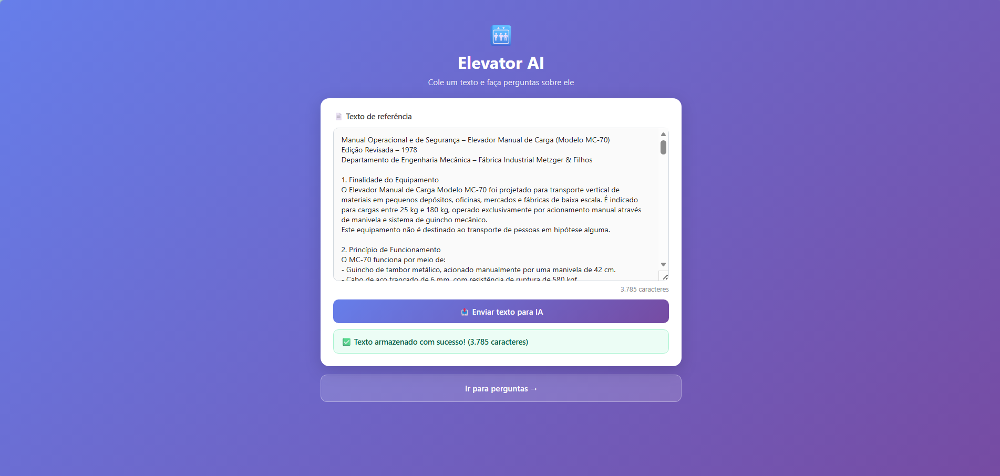
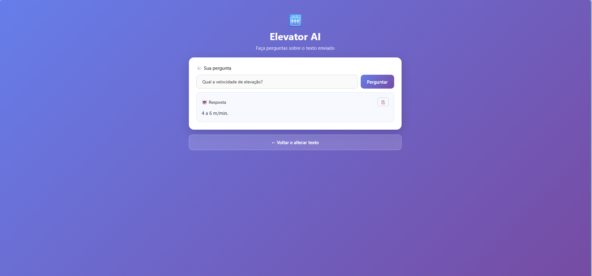

# 🚀 Elevator AI Assistant (MC-70)

Mini aplicação Full Stack com integração de Inteligência Artificial para responder perguntas com base em um texto técnico específico.

---

# 📌 Sobre o Projeto

Este projeto foi desenvolvido como parte de um teste técnico com o objetivo de criar uma aplicação capaz de:

* Receber um texto técnico (manual de elevador)
* Armazenar esse conteúdo em memória
* Permitir que o usuário faça perguntas
* Utilizar IA para responder **exclusivamente com base no texto fornecido**

---

## 📸 Visualizações

### Inserção de texto


### Consulta de perguntas


---


# 🧠 Tecnologias Utilizadas

## Backend

* Node.js
* Express
* Dotenv

## Frontend

* HTML
* CSS
* JavaScript (Vanilla)

## IA

* OpenAI API (modelo gpt-5-nano)

---

# 🏗️ Estrutura do Projeto

```
project/
│
├── backend/
│   ├── server.js
│   ├── ai.js
│   ├── package.json
│   └── .env
│
├── frontend/
│   ├── index.html
│   ├── ask.html
│   ├── style.css
│   └── script.js
```

---

# ⚙️ Como Executar o Projeto

## 1. Clonar o repositório

```bash
git clone https://github.com/Jezebel1990/elevator-ai-assistant.git
cd elevator-ai-assistant
```

---

## 2. Configurar o Backend

```bash
cd backend
npm install
```

### Criar arquivo `.env`

```env
OPENAI_API_KEY=sua_chave_aqui
```

---

## 3. Rodar o Backend

```bash
node server.js
```

Servidor disponível em:

```
http://localhost:3000
```

---

## 4. Rodar o Frontend

Em outro terminal:

```bash
cd frontend
npx serve -l 5000
```

Acesse:

```
http://localhost:5000
```

---

# 🧪 Como Usar

## 1. Enviar o texto

Cole um texto técnico (ex: manual do elevador MC-70) na tela inicial da aplicação.

```
Manual Operacional e de Segurança – Elevador Manual de Carga (Modelo MC-70)
Edição Revisada – 1978
Departamento de Engenharia Mecânica – Fábrica Industrial Metzger & Filhos

1. Finalidade do Equipamento
O Elevador Manual de Carga Modelo MC-70 foi projetado para transporte vertical de materiais em pequenos depósitos, oficinas, mercados e fábricas de baixa escala. É indicado para cargas entre 25 kg e 180 kg, operado exclusivamente por acionamento manual através de manivela e sistema de guincho mecânico.
Este equipamento não é destinado ao transporte de pessoas em hipótese alguma.

2. Princípio de Funcionamento
O MC-70 funciona por meio de:
- Guincho de tambor metálico, acionado manualmente por uma manivela de 42 cm.
- Cabo de aço trançado de 6 mm, com resistência de ruptura de 580 kgf.
- Embreagem de fricção, responsável por controlar descidas.
- Trava de segurança dentada, que impede retorno involuntário da carga.
- Guia lateral de madeira tratada ou metal, onde a cabine se desloca verticalmente.

A operação consiste na elevação da carga pela rotação da manivela, enrolando o cabo no tambor. Para descida, a embreagem é acionada parcialmente, permitindo controle fino da velocidade.

3. Capacidade e Limites Operacionais

3.1 Peso Máximo
- Capacidade nominal: 120 kg
- Capacidade máxima absoluta: 180 kg
O valor máximo deve ser utilizado apenas em situações excepcionais.

3.2 Tipos de Cabos Compatíveis
- Aço trançado 6x7 – 6 mm – 180 kg – Cabo padrão do equipamento
- Aço trançado 6x19 – 6,5 mm – 250 kg – Pode ser usado, mas reduz fluidez no tambor
- Corda sintética – Não permitido – Proibido por risco de ruptura

3.3 Velocidade Recomendada
- Elevação: 4 a 6 m/min
- Descida: controlada pela embreagem

4. Procedimentos de Operação

4.1 Elevação
1. Posicione a cabine no pavimento inferior.
2. Verifique se a trava dentada está engatada.
3. Centralize a carga na cabine.
4. Execute duas voltas de teste na manivela.
5. Gire no sentido horário.
6. Nunca solte a manivela abruptamente.

4.2 Descida
1. Desengate a trava dentada.
2. Acione a embreagem gradualmente.
3. Gire a manivela no sentido anti-horário.
4. Controle a velocidade pela embreagem.
5. Reengate a trava ao final.

5. Travamento e Segurança

5.1 Trava Dentada Automática
- Engata durante a subida.
- Deve produzir som metálico a cada dente.
- Se silenciosa, há risco de quebra da mola.

5.2 Freio de Emergência
- Atua se a descida exceder 1,8 m/s.
- Aquecimento maior que 60°C indica desgaste.

5.3 Travamento para Manutenção
- Utilizar o pino frontal no eixo da manivela.

6. Inspeção Diária
Verificar:
- Integridade do cabo (fios rompidos, ferrugem, lubrificação)
- Mandíbula da trava (alinhamento e mola)
- Embreagem (odor, ruído, suavidade)
- Cabine e estrutura (parafusos, trilhos, rodanas)
- Sons anormais durante operação

7. Manutenção Preventiva

30 dias:
- Engraxar rolamentos
- Lubrificar cabo
- Testar freio de emergência

6 meses:
- Trocar mola da trava
- Revisar lonas da embreagem
- Apertar suportes do tambor

12 meses:
- Trocar o cabo de aço
- Revisão estrutural completa

8. Superaquecimento da Embreagem

Causas:
- Descidas longas
- Controle inadequado
- Carga excessiva
- Lonas desgastadas

Sinais:
- Cheiro de queimado
- Tambor muito quente
- Solavancos na descida

Procedimento:
1. Parar operação.
2. Engatar trava dentada.
3. Aguardar 10–15 minutos.
4. Testar tambor com carga leve.
5. Continuar operação apenas sem sintomas.

9. Emergências
1. Travar equipamento com pino
2. Remover carga se seguro
3. Não liberar embreagem
4. Isolar área
5. Registrar ocorrência

10. Avisos Importantes
- Proibido transporte de pessoas
- Não usar cabos improvisados
- Operador não deve estar sob efeito de sedativos
- Uso obrigatório de luvas
- Não retirar proteções
- Afastar curiosos da área
```

---

## 2. Fazer perguntas

* Acesse a tela de perguntas
* Digite uma pergunta
* Clique em **Perguntar**

---

# 💬 Exemplos de Perguntas

## Perguntas válidas

* Qual a capacidade máxima do elevador?
* O equipamento pode transportar pessoas?
* Qual a velocidade de elevação?
* O que fazer em caso de superaquecimento?

## Perguntas inválidas

* Qual o consumo de energia?
* O elevador usa motor elétrico?

---

# 🧠 Decisões Técnicas

### 1. Prompt Controlado

A IA é guiada por um prompt estruturado para evitar respostas fora do contexto.

### 2. Armazenamento em Memória

O texto é armazenado em variável simples no backend, conforme requisito do teste.

### 3. Arquitetura Simples

Separação clara entre frontend e backend via API REST.

---

# 🚀 Possíveis Melhorias

* Interface mais robusta
* Histórico de perguntas

---

# 👩‍💻 Autora

Desenvolvido por Jezebel Guedes
